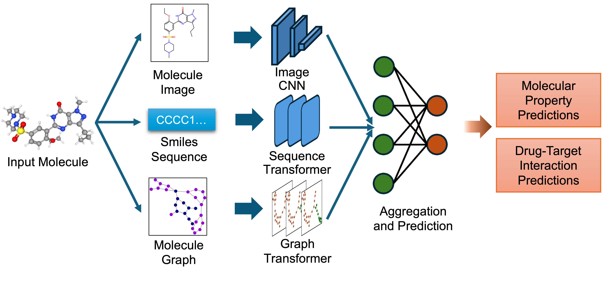

[](https://pepy.tech/projects/biomed-multi-view)
[](https://github.com/MShawon/github-clone-count-badge)


# Introduction

This repository contains the implementation of the Multi-view Molecular Embedding with Late Fusion (MMELON) architecture presented in our preprint [Multi-view biomedical foundation models for molecule-target and property prediction](https://arxiv.org/abs/2410.19704). MMELON is a flexible approach to aggregate multiple views (sequence, image, graph) of molecules in a foundation model setting. While models based on single view representation typically performs well on some downstream tasks and not others, the multi-view model performs robustly across a wide range of property prediction tasks encompassing ligand-protein binding, molecular solubility, metabolism and toxicity. It has been applied to screen compounds against a large (> 100 targets) set of G Protein-Coupled receptors (GPCRs) to identify strong binders for 33 targets related to Alzheimer’s disease, which are validated through structure-based modeling and identification of key binding motifs.

Our model integrates:

* Image Representation: Captures the 2D visual depiction of molecular structures, highlighting features like symmetry, bond angles, and functional groups. Molecular images are generated using RDKit and undergo data augmentation during training to enhance robustness.
* Graph Representation: Encodes molecules as undirected graphs where nodes represent atoms and edges represent bonds. Atom-specific properties (e.g., atomic number, chirality) and bond-specific properties (e.g., bond type, stereochemistry) are embedded using categorical embedding techniques.
* Text Representation: Utilizes SMILES strings to represent chemical structures, tokenized with a custom tokenizer. The sequences are embedded using a transformer-based architecture to capture the sequential nature of the chemical information.

The embeddings from these single-view pre-trained encoders are combined using an attention-based aggregator module. This module learns to weight each view appropriately, producing a unified multi-view embedding. This approach leverages the strengths of each representation to improve performance on downstream predictive tasks.



_Figure: Schematic of multi-view architecture. Embeddings from three single view pre-trained encoders (Image, Graph and Text) are combined by the aggregator module into a combined embedding. The network is finetunable for downstream predictive tasks._

Our pre-training dataset comprises 200 million molecules sourced from the PubChem and ZINC22 chemical databases, ensuring diversity and relevance to downstream tasks. Each view encoder is pre-trained with self-supervised tasks tailored to capture the unique features of its representation.

MMELON’s extensible architecture allows for seamless integration of additional views, making it a versatile tool for molecular representation learning. For further details, see [here](https://arxiv.org/abs/2410.19704).

Specifically, this branch is designed to fine-tune MMELON model on the [DREAM Target 2035 Drug Discovery Challenge](https://www.synapse.org/Synapse:syn65660836/wiki/632256). Steps are simplified and slightly difference in this branch. More instructions can be found in the [main branch](https://github.com/BiomedSciAI/biomed-multi-view).

# Getting started with `MMELON`

## Installation
Follow these steps to set up the `biomed-multi-view` codebase on your system.

### Prerequisites
* Operating System: Linux or macOS
* Python Version: Python 3.11
* Conda: Anaconda or Miniconda installed
* Git: Version control to clone the repository


### Step 1: Set up the project directory
Choose a root directory where you want to install biomed.multi-view. For example:

```bash
export ROOT_DIR=~/biomed-multiview
mkdir -p $ROOT_DIR
```

#### Step 2: Create and activate a Conda environment
```bash
conda create -y python=3.11 --prefix $ROOT_DIR/envs/biomed-multiview
```
Activate the environment:
```bash
conda activate $ROOT_DIR/envs/biomed-multiview
```

#### Step 3: Clone the repository
Navigate to the project directory and clone the repository:
```bash
mkdir -p $ROOT_DIR/code
cd $ROOT_DIR/code

# Clone the repository using HTTPS
git clone https://github.com/BiomedSciAI/biomed-multi-view.git

# Navigate into the cloned repository
cd biomed-multi-view
```
Note: If you prefer using SSH, ensure that your SSH keys are set up with GitHub and use the following command:
```bash
git clone git@github.com:BiomedSciAI/biomed-multi-view.git
```

#### Step 4: Install package dependencies
If you are installing in a Mac, skip this step and proceed to next step. Else, install the package in editable mode along with development dependencies:
``` bash
pip install -e .['dev']
```
Install additional requirements:
``` bash
pip install -r requirements.txt
```

#### Step 5: macOS-Specific instructions (Apple Silicon)
If you are using a Mac with Apple Silicon (M1/M2/M3) and the zsh shell, you may need to disable globbing for the installation command:

``` bash
noglob pip install -e .[dev]
```
Install macOS-specific requirements optimized for Apple’s Metal Performance Shaders (MPS):
```bash
pip install -r requirements-mps.txt
```

#### Step 6:  Installation verification (optional)
Verify that the installation was successful by running unit tests

```bash
python -m unittest bmfm_sm.tests.all_tests
```

#### Summary of commands
Here’s a consolidated list of commands for quick reference:
```bash
# Set up the root directory
export ROOT_DIR=~/biomed-multiview
mkdir -p $ROOT_DIR

# Create and activate the Conda environment
conda create -y python=3.11 --prefix $ROOT_DIR/envs/biomed-multiview
conda activate $ROOT_DIR/envs/biomed-multiview

# Clone the repository
mkdir -p $ROOT_DIR/code
cd $ROOT_DIR/code
git clone https://github.com/BiomedSciAI/biomed-multi-view.git
cd biomed-multi-view

# Install dependencies (non-macOS)
pip install -e .[dev]
pip install -r requirements.txt

# For macOS with Apple Silicon
noglob pip install -e .[dev]
pip install -r requirements-mps.txt

# Verify installation
python -m unittest bmfm_sm.tests.all_tests
```

## Data preparation
To evaluate and train the models, you need to set up the necessary data, splits, configuration files, and model checkpoints. This section will guide you through the process.

#### Step 1: Set up the `$data_root` directory
First, create a directory to serve as your root directory for all the data. This directory will house all datasets, splits, configuration files, and model checkpoints.
```bash
mkdir -p $ROOT_DIR/code/biomed-multi-view/data_root
```

#### Step 2: Set the environment variable
Set the `$BMFM_HOME` environment variable to point to your data root directory. This helps the scripts locate your data.
```bash
export BMFM_HOME=$ROOT_DIR/code/biomed-multi-view/data_root
```
Optionally, add the export command to your shell configuration file (e.g., $HOME/.bashrc for bash):
```bash
echo 'export BMFM_HOME=$ROOT_DIR/code/biomed-multi-view/data_root' >> $HOME/.bashrc
```

#### Step 3: Download the checkpoints and DREAM Challenge data
We provide all the necessary data splits, configuration files, and model checkpoints in a single archive to simplify the setup process.

* Download `data_root_dream.tar.gz`: from [this location](https://ibm.box.com/s/t0l7efzu5ty4pp3f9s2dhallt7kmzspf).
* Extract the Archive: 	Uncompress the tar file into your data root directory
  ```bash
  tar -xzvf data_root_dream.tar.gz -C $BMFM_HOME
  ```
This will populate `$BMFM_HOME` with the required files and directories.

#### Step 4. Verify the directory structure
After completing the above steps, your `$BMFM_HOME` directory should have the following structure:
```bash
tree $BMFM_HOME
$BMFM_HOME
├── bmfm_model_dir
│   └── pretrained
│       └── MULTIVIEW_MODEL
│           ├── biomed-smmv-base.pth
│           └── biomed-smmv-with-coeff-agg.pth
└── datasets
    ├── raw_data
    │   └── other
    │       ├── dreamtarget2035_test.csv
    │       └── dreamtarget2035_train.csv
    └── splits
        └── other
            └── random
                ├── dreamtarget2035_test_split.json
                └── dreamtarget2035_train_split.json
```

### Finetuning
To finetune the pretrained model on a specific dataset, use the --fit option:
``` bash
cd $ROOT_DIR/code/biomed-multi-view/
python -m bmfm_sm.launch.run_finetune --fit --dataset dreamtarget2035 --config config_train.yaml
```
This command will start the finetuning process for the DREAM dataset using the train configuration file. As an example, we simply created the training data (n=100) by combinining 14 public-domain WDR91 ligands (label = 1) and 86 randomly selected compounds from the 339k set (label = 0).

To make predictions on testing dataset, use the --test option:
``` bash
python -m bmfm_sm.launch.run_finetune --test --dataset dreamtarget2035 --config config_test.yaml
```
This command will start the predicting process on the DREAM testing set of 339k compounds. The finetuned model and predictions will be saved in the outputs folder with a structure like this:
```bash
outputs/
└── MULTIVIEW_MODEL
    └── pred_MULTIVIEW_MODEL_ft_dreamtarget2035_random_s-101_f-1.0
        ├── checkpoints
        │   ├── best.ckpt
        │   └── last.ckpt
        ├── logs
        │   └── lightning_logs
        │       ├── version_0
        │       │   ├── config.yaml
        │       │   ├── events.out.tfevents.1748395567.teddy.2372031.0
        │       │   └── hparams.yaml
        │       └── version_1
        │           ├── config.yaml
        │           ├── events.out.tfevents.1748395893.teddy.2376790.0
        │           └── hparams.yaml
        ├── modality_coeff_test_version_1.csv
        ├── parameter_norms_version_0.png
        ├── resolved_config.yaml
        └── test_predictions_version_1.csv
```
Note that in the prediction table **test_predictions_version_1.csv**, values are output logits that can be transformed to probablities via sigmoid. An example script is also provided to transform and select top 50 predictions for Challenge step 2:

```bash
python transform_and_select_top_predictions.py 
```
This script creates a submission file **Step2-submission-file.csv** of top 50 predicted compounds for Challenge step 2.

# Citations

```
@misc{suryanarayanan2024multiviewbiomedicalfoundationmodels,
      title={Multi-view biomedical foundation models for molecule-target and property prediction},
      author={Parthasarathy Suryanarayanan and Yunguang Qiu and Shreyans Sethi and Diwakar Mahajan and Hongyang Li and Yuxin Yang and Elif Eyigoz and Aldo Guzman Saenz and Daniel E. Platt and Timothy H. Rumbell and Kenney Ng and Sanjoy Dey and Myson Burch and Bum Chul Kwon and Pablo Meyer and Feixiong Cheng and Jianying Hu and Joseph A. Morrone},
      year={2024},
      eprint={2410.19704},
      archivePrefix={arXiv},
      primaryClass={q-bio.BM},
      url={https://arxiv.org/abs/2410.19704},
}
```
